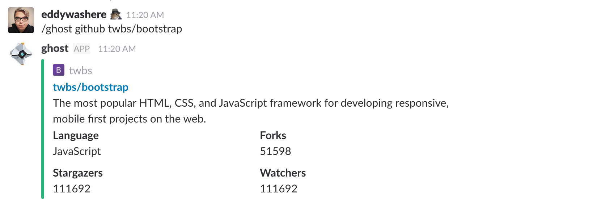

# ghost-bot

A CLI inspired lambda chat bot and CLI. Built with [yargs](http://yargs.js.org), [yargs-promise](https://github.com/eddywashere/yargs-promise), and [Claudia.js](https://claudiajs.com).

## Resources

- [Cladia.js](https://claudiajs.com/tutorials/index.html)
- [Delayed Responses to Slack Slash Commands](https://claudiajs.com/tutorials/slack-delayed-responses.html)
- [Yargs Docs](http://yargs.js.org/docs/)

## Setup

Install dependencies via yarn:

```
yarn install
```

or install dependencies via npm:

```
npm install
```

## Running locally

To test the command functionality without deploying, run `npm link` to link this package to your global npm modules. It's very similar to running `npm install -g {packagename}`. (make sure the )

```sh
cd ghost-bot
npm link

ghost --help
```

## From slack

Type out `/ghost logs` or `/ghost --help` for more info.

## Deploying

Create a slack slash command and grab the token - [docs](https://my.slack.com/services/new/slash-commands)

Create the lambda and configure the slash command.

```
npm run claudia:create
```

Deploying

```
npm run claudia:update
```

## Example


